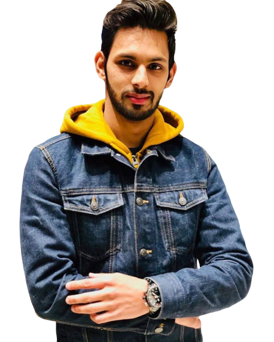

# markdown

# Asad Siddiqui

### *Remember how far you have come, not just how far you have to go* 

### "Me, in one sentence"

About | Me
-------- | -----
Bithday | 25/06/97
Food | Burger
Color | Yellow
Pineapple on pizza| <ul> <li> - [x] No </li> <li> - [x] Yes </li> </ul>

### Hobbies

- Basketball
  * Mon équipe préférée est NBA
- Football
  * My favourite team est Brasil
- Cricket
  * My favourite team est Pakistan
  
  ### You can always count on me when...
  
 Je comprends l'importance de travaille en groupe. Je viendrai toujours avec de nouvelles idées qui peuvent aider à résoudre plusieurs problèmes. Ma contribution sera dynamique et maintiendra l'ambiance chaleureuse afin que nous puissions terminer notre mission à temps
  
  ### A funny story
  
  Quand j'habitais au pakistan il ya 12 ans de là. Souvent il y avait la coupure d'electricité le soir dans le quartier. Et donc je mettais le cotch avec mes amis sur les sonnets de toutes les maison du quartier et dès l'électricité revenait toute la ville sonnait 
  
  #### TL;DR :
  
  hahahahah ahahaha hahahaha
  
  
[Previous](https://github.com/Souabou/markdownchallenge/blob/master/README.md). || Asad Siddiqui || [Next](https://github.com/GemaHonesta/markdownchallenge/edit/master/README.md).

  
